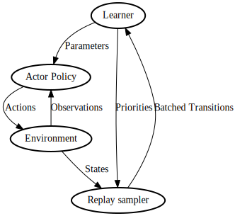

### RL-Flow

RL Flow is a set of platform agnostic tools that handles the data flow of reinforcement learning in a performant and composable way.

It is designed after Deepmind ACME ([code](https://github.com/deepmind/acme), [paper](https://arxiv.org/abs/2006.00979)).
Like ACME, the design philosophy is to separate the various parts of the RL data pipeline in a simple, composable manner with enough built-in functionality to implement simple RL baselines in two dozen lines of code and state of the art methods in a hundred lines of code. A user of different needs and different level of expertise can use the tools at different levels.

The modern RL data flow looks roughly like this:



The user is expected to provide the actor's policy, the learner, and an environment. We provide utilities to wrap gym and pettingzoo environments, make implementing the actor and environment easier, and also add enough functionality in the adder, and replay sampler to implement state of the art methods.

## Example code

You will be expected to implement the Learner, Policy interfaces and provide a suitable gym environment.

### Learner class

The learner class has several methods

```
```

## Components

Internally, there are many more components. These components can also be used independently of the higher level interface above. The data flow here looks a bit more complicated

### Learner class

The main job for the user is to define the learner.

The learner class needs to define a `step` method

Here is an example:

```
class Learner:
  def step(self, transition):
    pass
```

### Adder class

The adder class takes in states (observation, reward, done, info), and generates transitions, which are what the learner want.

Here is the most simple adder class, TransitionAdder:

```
class TransitionAdder:
    def __init__(self, on_generate):
        self.last_observation = None
        self.on_generate = on_generate

    def add(self, obs, rew, done, info):
        if self.last_observation is None:
            self.last_observation = obs
        else:
            if done:
                transition = (None, rew, self.last_observation)
            else:
                transition = (obs, rew, self.last_observation)
            self.on_generate(transition)
            self.last_observation = obs
```


### Selector class

The replay sampler is in charge of sampling data for training. For example prioritized experience replay is implemented by a specialized selector.

Here is what the selector class looks like:

```
class BaseScheme:
    def add(self, id, priority):
        '''
        args:
          id: unique id of data that needs to be created or updated
          priority: priority of data (only needed for selectors which use it, can be ignored)
        '''
    def sample(self):
        '''
        returns:
        - id of sampled data
        '''
    def remove(self, id):
        '''
        removes the id from the data
        '''
    def update_priorities(self, id, priority):
        '''
        Called by the learner.
        optional: only needed for prioritized experience replay
        '''
```

### Actor
