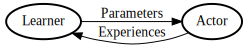
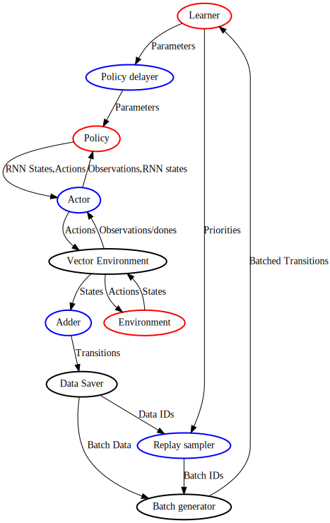

# RL-Flow high level interface tutorial

This tutorial is meant to guide you through the components and ideas of RL-Flow and show you how put together some classic RL methods with this toolset.

## Concepts

### Actor-Learner dichotomy

RL-Flow makes a clear, enforced distinction between

* Actor: an agent that interacts with the environment in an online manner. The actor receives network parameters generated by the learner
* Learner: an machine learning algorithm which trains on experiences generated by the actor.

To illustrate this simply,

### Policy Delayer

It is well known that there are advantages to *not* keeping the actor in perfect sync with the learner. In particular, if the actor and learner are in perfect sync, the learner can overfit to the current environment state, which can cause learning instability.

Instead, the actor network should be delayed behind the learner network.

This distinction is not only useful for implementing asynchronous actors and other performance improvements, but also is useful for implementing target networks and other solutions to the instability problem of online learners.

## Components

The core concept behind RL-Flow is to divide the RL algorithm into 6  components, 3 of which the user needs to provide, and 3 of which the user can choose from good defaults in RL-Flow:

User provided components

* Learner
* Policy
* Environment

Configurable components

* Actor
* Policy Delayer
* Sampling Scheme

Here is how they all fit together:

Lets go through these one by one

### Policy

As in the RL theory, the policy stores the parameters for the policy function.

To support actors which have seperate weights from the learner, as in , the policy class needs to be able to load and store parameters.

This class has

### Learner

The learner is where all the machine learning happens. Losses,
